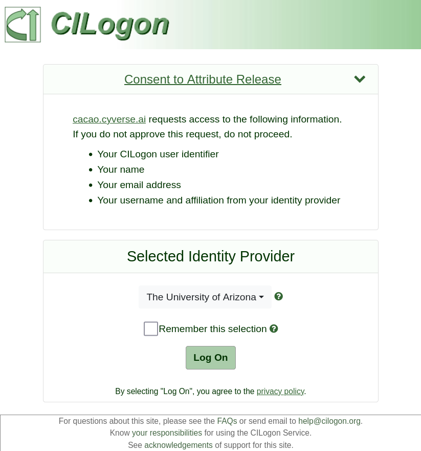
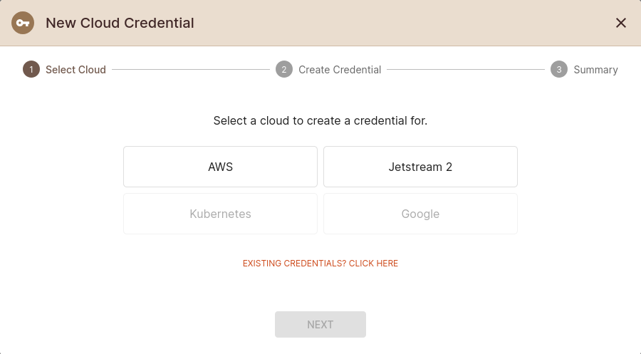
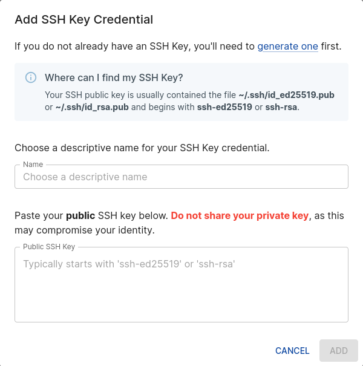
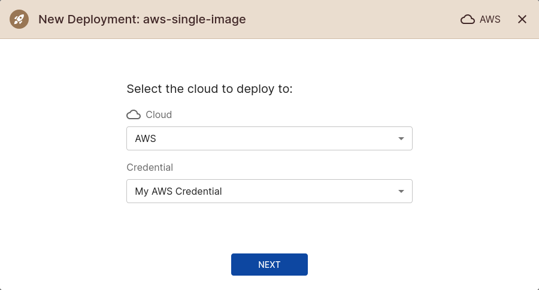

## Log into CACAO (University of Arizona/AWS)

To start, you will need an AWS secret and access key

Go to [https://cacao.cyverse.ai](https://cacao.cyverse.ai){target=_blank} to log in to CACAO. You will be prompted to authenticate with CILogon.

!!! info
    You should select "The University of Arizona" as your identity provider.

### Add your Cloud Credential

Next, you will need to add cloud computing credentials. For now, the only option is AWS, but in the future, other providers like Google and AWS will be supported.

Click on Credentials on the lefthand menu bar. From the Credentials page, click the "+ Add Credential" button and select "Cloud Credential". Select AWS and the project you would like to add. These correspond to AWS projects you have access to.

Once your credential is added, it should show up on the Credentials page.

### Adding an SSH Key

For this workshop we will not need to add an SSH Key because we will use web shell; however if you plan to use CACAO for your own work in the future, you would want to add at least one SSH Key.

This will allow you to access your VMs via SSH. If you already have an SSH key, you can use that. Otherwise, you can generate a new one.

To add an SSH Key (outside of the workshopp), click on the "+ Add Credential" button and this time select "Public SSH Key". Enter a name and paste in your public key.

### Browse the Template Catalog

Click on the [:material-widgets: Templates](https://cacao.cyverse.ai/templates) tab on the lefthand menu bar. You will see a list of templates available in CACAO.

A template is a recipe to deploy cloud resources to create a portal, a software stack, or anything that the template author envisions.

The following information is available in the template catalog:

* Title
* Description
* Tags
* The CACAO user who imported the template
* Last updated
* Declared author of the template (metadata pulled from the git repository)

Click on Learn More button on the template titled `aws-single-image` to get more details.

The details page will have additional information, including

* Declared author contact information (if provided)
* Parameters
* Source code links

### Start a Deployment

Next, we will start a deployment onto AWS.

Click on the ":material-rocket-launch: Deploy" button of the "aws-single-image" template.

You will see a box pop up where you can select the cloud and cloud credential to use for the deployment.

You will then name the deployment, select the number of instances and size of instances.
For now, stick with `us-east-1` or `us-west-2` region, `ubuntu-minimal/images/hvm-ssd/ubuntu-jammy-22.04-amd64-minimal-20240729` image and 1 instance of `t2.micro`. You can name it whatever you want.

### Access Deployment

Once you have submitted your deployment, you can see it on the Deployments page. It will be in the "Starting" status for a few minutes. Once it is running, you can click on it to see details about it and to access it.

From here, you can click on the icons on the right to access a Web Shell. 

### Delete Your Deployment

Click on the Delete icon in either the Deployment List or Deployment Details