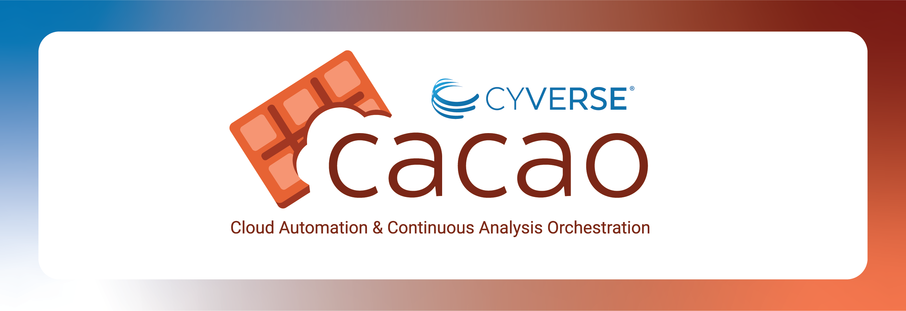

[{width="400"}](https://learning.cyverse.org){target=_blank}

# Welcome to CyVerse CACAO Workshop for IT Summit 2024 

## [:material-run-fast: Go to Workshop Agenda](getting_started/schedule.md)

Welcome to our CACAO Workshop for the University of Arizona IT Summit 2024

## Agenda

| Time (MST/AZ)| Activity | Instructor | Notes | 
|-----------|----------|------------|-------|
| 1:00p | Introductions | All | |
| 1:15p | Getting Setup | All | |
| 1:30p | [Introduction to Terraform :material-github:](../cacao/terra.md) | Frady | |
| 2:00p | [Importing a Terraform template into CACAO :material-docker:](../cacao/cacao_terra.md) | Skidmore | |
| 2:10p | Break | |
| 2:20p | [Using CACAO :material-docker:](./cacao/cacao.md)  | Xu | |
| 2:40p | [CACAO Use Cases :material-docker:](../cacao/cacao.md) | Cosi | | 
| 2:45p | Conclusion: Comments and questions | | |

!!! Success "Learning Objectives"

        After completing these two paired workshops, you should be able to:
        
        * Explain why containers and orchestration are used in research computing
        * Create your own containers and deploy your own orchestrated frameworks
        * Understand how and when to use containers and IaC in your daily work

        You will also leave with

        - Understanding of how to use the most powerful public research computing infrastructure in the world via [ACCESS-CI](https://access-ci.org).
        - The ability to launch and manage distributed resources using IaC templates on commercial (AWS, GCloud, Azure) or public research (OpenStack) clouds.

        - Insight into commercial cloud services, their costs, and how to best utilize them for scientific research.

---

**Funding and Citations:**

CyVerse is generously funded by the National Science Foundation [{width="25"}](https://nsf.gov){target=_blank}. 

Here are our award numbers:

- 
- 
- 

For any utilization of our resources, please adhere to the [CyVerse citation policy](https://cyverse.org/policies/cite-cyverse).
